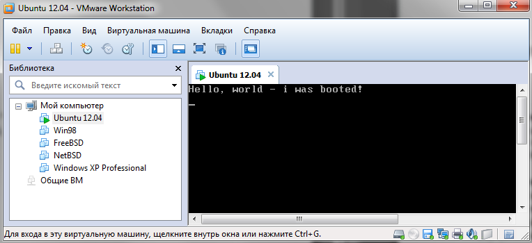

Задание

1. В загрузочный сектор поместить программу вывода на экран произвольного сообщения. Программу написать на ассемблере (предпочтительно встраиваемом в стандартную конфигурацию ) и на С (при необходимости допустимы ассемблерные вставки), убедиться в работоспособности обоих вариантов. См. пример кода ниже. В качестве носителя предпочтителен выбор флэш. Начать можно с экспериментов над виртуальной дискетой, как показано ниже.
2. Создать первичный загрузчик для виртуального, а затем реального носителя, (пример показан для виртуальной дискеты и ФС FAT12/16), который будет находить файл программы на носителе и загружать ее на выполнение. Сделать 2 варианта на разных языках (asm и С). Привести весь план экспериментов и результаты их проведения в виде «логфайлов» и screenshot –ов. ФС можно выбрать на свое усмотрение.

**Описание для выполнения задания**

Загрузка системы 1)начинается с того, что BIOS считывает **первый сектор** блочного носителя, например, жесткого диска, 2)размещает его в памяти (ОЗУ) по адресу 0000:7С00h и 3)передает туда управление.

Этот сектор называется главным загрузочным сектором (Master Boot Record, сокращенно MBR). В начале записи MBR расположен код загрузчика.

Следом за ним идет таблица разделов, описывающая схему разбиения логических дисков.

В конце сектора находится сигнатура 55h AAh, подтверждающая, что это действительно MBR.

Если хотя бы один из двух последних байтов отличается по значению, считается, что первый сектор не является MBR и не содержит осмысленной информации.

BIOS загружает MBR по адресу 7C00h, поэтому в начале ассемблерного кода должна стоять директива ORG 7C00h. Кроме того, необходимо указать директиву USE16, потому что **загрузчик выполняется в 16-разряном режиме**.

Попробуем реализовать на ассемблере простейшую программу, которая выводит приветственное сообщение на экран, и поместим ее в загрузочный сектор.

1. **1.**** Пример реализации вывода сообщения из **** MBR**

Текст программы:

use16

org  0x7C00

; Очищаем регистры

        xor        ax, ax

 mov es, ax

 mov ds, ax

 mov ss, ax

        mov        sp, 0x1000

; Установим видеорежим, очистка экрана

 mov ax, 3

 int 10h

; Вывод приветственного сообщения

 mov si, mHello

 call print

; Зависаем в бесконечном цикле

die: jmp short die

mHello db &#39;Hello, world - i was booted!&#39;,10,13,0

; Подпрограммавывода

print:

 cld

 pusha

.PrintChar:

 lodsb

 test al, al

 jz short .Exit

 mov ah, 0eh

 mov bl, 7

 int 10h

 jmp short .PrintChar

.Exit:

        popa

 ret

Компилируем  программу:

&gt;nasm -f bin boothi.asm -o boothi

Мы получили исполняемый код (файл **boothi** ). Теперь можно записать его в MBR раздел дискеты и, при загрузке с этой дискеты, мы увидим на экране приветственное сообщение.

 

Реализованная программа делает то, что нам надо – выводит приветственное сообщение на экран при загрузке. Однако загрузчиком она не является.

**2. Пример реализации первичного загрузчика для дискеты с поиском файла в ФС**  **FAT**  **и загрузкой на выполнение**

Рассмотрим теперь реализацию первичного загрузчика для дискеты, который будет находить файл этой программы и загружать ее на выполнение.

Для этого необходимо работать с файловой системой.  Заголовок файловой системы FAT содержит всю необходимую информацию о файловой системе и находится в первом секторе дискеты, благодаря чему он загружается вместе с загрузчиком. Первичный загрузчик будет искать в корневом каталоге исполняемый файл программы, загрузит его в память и передаст управление на его начало.

В начале загрузочного сектора располагается заголовок FAT:

; Общая часть для всех типов FAT

BS\_jmpBoot:

jmp short BootStart ; Переходим на код загрузчика

nop

BS\_OEMName        db &#39;\*-v4VIHC&#39;        ; 8 байт, (что было на моей дискете)

BPB\_BytsPerSec dw 0x200 ; Байт на сектор

BPB\_SecPerClus db 1 ; Секторов на кластер

BPB\_RsvdSecCnt dw 1 ; Число резервных секторов

BPB\_NumFATs db 2 ; Количектво копий FAT

BPB\_RootEntCnt dw 224 ; Элементов в корневом катологе (max)

BPB\_TotSec16 dw 2880 ; Всего секторов или 0

BPB\_Media db 0xF0 ; код типа устройства

BPB\_FATsz16 dw 9 ; Секторов на элемент таблицы FAT

BPB\_SecPerTrk dw 18 ; Секторов на дорожку

BPB\_NumHeads dw 2 ; Число головок

BPB\_HiddSec dd 0 ; Скрытых секторов

BPB\_TotSec32 dd 0 ; Всего секторов или 0

; Заголовок для FAT12 и FAT16

BS\_DrvNum db 0 ; Номер дика для прерывания int 0x13

BS\_ResNT db 0 ; Зарезервировано для Windows NT

BS\_BootSig db 29h ; Сигнатура расширения

BS\_VolID dd 2a876CE1h ; Серийный номер тома

BS\_VolLab db &#39;X boot disk&#39; ; 11 байт, метка тома

BS\_FilSysType        db &#39;FAT12   &#39;        ; 8 байт, типФС

; Структура элемента каталога

struc DirItem

 DIR\_Name: resb 11

        DIR\_Attr:        resb 1

 DIR\_ResNT: resb 1

 DIR\_CrtTimeTenth resb 1

 DIR\_CrtTime: resw 1

        DIR\_CrtDate:        resw 1

 DIR\_LstAccDate: resw 1

 DIR\_FstClusHi: resw 1

 DIR\_WrtTime: resw 1

 DIR\_WrtDate: resw 1

 DIR\_FstClusLow: resw 1

        DIR\_FileSize:        resd 1

endstruc ;DirItem

Загрузчик BIOS передает управление на начало загрузочного сектора, то есть на BS\_jmpBoot, поэтому в начале заголовка FAT отводится 3 байта для короткой или длинной инструкции jmp. В данном случае используется короткая и пустая операция nop. Таким образом, мы «прыгаем» на наш код.

Описываем переменные и очищаем регистры:

; Не инициализированные переменные

; При инициализации они затрут не нужные поля заголовка FAT: BS\_jmpBoot и BS\_OEMName

struc NotInitData

 SysSize: resd 1 ; Размер системной области FAT

 fails: resd 1 ; Число неудачных попыток при чтении

 fat: resd 1 ; Номер загруженного сектора с элементами FAT

endstruc ;NotInitData

; По этому адресу мы будем загружать загрузчик

%define SETUP\_ADDR 0x1000

; А по этому адресу нас должны были загрузить

%define BOOT\_ADDR 0x7C00

%define BUF 0x500

BootStart:

 cld

 xor cx, cx

 mov ss, cx

 mov es, cx

        mov        ds, cx

 mov sp, BOOT\_ADDR

 mov bp, sp

        ; Сообщим о том что мы загружаемся

        mov        si, BOOT\_ADDR + mLoading

 call print

Все сегментные регистры настраиваем на начало физической памяти, вершину стека настраиваем на начало сектора.

(Процедуру print, выводящую сообщение на экран, см.ниже)

Теперь нужно вычислить номера первых секторов корневого каталога и данных файлов:

        mov        al, [byte bp+BPB\_NumFATs]

 cbw

 mul word [byte bp+BPB\_FATsz16]

 add ax, [byte bp+BPB\_HiddSec]

 adc dx, [byte bp+BPB\_HiddSec+2]

        add        ax, [byte bp+BPB\_RsvdSecCnt]

 adc dx, cx

 mov si, [byte bp+BPB\_RootEntCnt]

        ; dx:ax - Номер первого сектора корневого каталога

 ; si - Количество элементов в корневом каталоге

 pusha

 ; Вычислим размер системной области FAT = резервные сектора +

 ; все копии FAT + корневой каталог

 mov [bp+SysSize], ax ; осталось добавить размер каталога

 mov [bp+SysSize+2], dx

 ; Вычислим размер корневого каталога

 mov ax, 32

 mul si

 ; dx:ax - размер корневого каталога в байтах, а надо в секторах

        mov        bx, [byte bp+BPB\_BytsPerSec]

        add        ax, bx

 dec ax

 div bx

        ; ax - размер корневого каталога в секторах

 add [bp+SysSize], ax ; Теперь мы знаем размер системной

 adc [bp+SysSize+2], cx ; области FAT, и начало области данных

 popa

 ; В dx:ax - снова номер первого сектора корневого каталога

 ; si - количество элементов в корневом каталоге

Просматриваем корневой каталог в поисках нужного файла:

NextDirSector:

 ; Загрузим очередной сектор каталога во временный буфер

 mov bx, 700h ; es:bx - буфер для считываемого сектора

 mov di, bx ; указатель текущего элемента каталога

 mov cx, 1 ; количество секторов для чтения

        call        ReadSectors

        jc        near DiskError        ; ошибкапричтении

RootDirLoop:

        ; Ищемнашфайл

        ; cx = 0 послефункции ReadSectors

 cmp [di], ch ; byte ptr [di] = 0?

        jz        near NotFound        ; Да, это последний элемент в каталоге

 ; Нет, не последний, сравним имя файла

 pusha

 mov cl, 11 ; длина имени файла с расширением

 mov si, BOOT\_ADDR + LoaderName ; указатель на имя искомого файла

 rep cmpsb ; сравниваем

 popa

 jz short Found ; Нашли, выходим из цикла

 ; Нет, ищем дальше

 dec si ; RootEntCnt

 jz near NotFound ; Это был последний элемент каталога

 add di, 32 ; Переходим к следующему элементу каталога

 ; bx указывает на конец прочтенного сектора после call ReadSectors

 cmp di, bx ; Последний элемент в буфере?

 jb short RootDirLoop ; Нет, проверим следующий элемент

 jmp short NextDirSector ; Да последний, загрузим следующий сектор

В результате возможны следующие варианты: ошибка при чтении (метка DiskError), файл найден (метка Found), файл не найден (метка NotFound).

Если файл найден, то загружаем его в память и передаем управление на его начало:

Found:

 ; Загрузка загрузчика (извините, каламбур)

 mov bx, SETUP\_ADDR

 mov ax, [byte di+DIR\_FstClusLow] ; Номер первого кластера файла

 ; Загружаем сектор с элемнтами FAT, среди которых есть FAT[ax]

 ; LoadFAT сохраняет значения всех регистров

 call LoadFAT

ReadCluster:

 ; ax - Номер очередного кластера

 ; Загрузим его в память

 push ax

 ; Первые два элемента FAT служебные

 dec ax

 dec ax

 ; Число секторов для чтения

 ; cx = 0 после ReadSectors

 mov cl, [byte bp+BPB\_SecPerClus] ; Секторов на кластер

 mul cx

 ; dx:ax - Смещение кластера относительно области данных

        add        ax, [byte bp+SysSize]

 adc dx, [byte bp+SysSize+2]

        ; dx:ax - Номер первого сектора требуемого кластера

 ; cx еще хранит количество секторов на кластер

 ; es:bx - конец прошлого кластера и начало нового

 call ReadSectors ; читаем кластер

 jc near DiskError ; Увы, ошибка чтения

 pop ax ; Номер кластера

 ; Это конец файла?

 ; Получим значение следующего элемента FAT

 pusha

 ; Вычислим адрес элемента FAT

 mov bx, ax

        shl        ax, 1

 add ax, bx

 shr ax, 1

        ; Получим номер сектора, в котором находится текущий элемент FAT

        cwd

 div word [byte bp+BPB\_BytsPerSec]

        cmp        ax, [bp+fat]        ; Мы уже читали этот сектор?

 popa

 je Checked ; Да, читали

 ; Нет, надо загрузить этот сектор

 call LoadFAT

Checked:

 ; Вычислим адрес элемента FAT в буфере

        push        bx

 mov bx, ax

 shl bx, 1

 add bx, ax

 shr bx, 1

        and        bx, 511        ; остаток от деления на 512

 mov bx, [bx+0x700] ; а вот и адрес

 ; Извлечем следующий элемент FAT

 ; В FAT16 и FAT32 все немного проще :(

        test        al, 1

 jnz odd

 and bx, 0xFFF

 jmp short done

odd:

 shr bx, 4

done:

 mov ax, bx

 pop bx

        ; bx - новыйэлемент FAT

        cmp        ax, 0xFF8        ; EOF - конецфайла?

        jb        ReadCluster        ; Нет, читаем следующий кластер

 ; Наконец-то загрузили

 mov ax, SETUP\_ADDR&gt;&gt;4 ; SETUP\_SEG

        mov        es, ax

 mov ds, ax

        ; Передаем управление, наше дело сделано :)

 jmp SETUP\_ADDR&gt;&gt;4:0

LoadFAT:

; Процедура для загрузки сектора с элементами FAT

; Элемент ax должен находится в этом секторе

; Процедура не должна менять никаких регистров

 pusha

 ; Вычисляем адрес слова содержащего нужный элемент

        mov        bx, ax

 shl ax, 1

 add ax, bx

 shr ax, 1

 cwd

 div word [byte bp+BPB\_BytsPerSec]

        ; ax - смещение сектора относительно начала таблицы FAT

 mov [bp+fat], ax ; Запомним это смещение, dx = 0

 cwd   ; dx:ax - номер сектора, содержащего FAT[?]

 ; Добавим смещение к первой копии таблицы FAT

 add ax, [byte bp+BPB\_RsvdSecCnt]

        adc        dx, 0

 add ax, [byte bp+BPB\_HiddSec]

 adc dx, [byte bp+BPB\_HiddSec+2]

        mov        cx, 1        ; Читаем один сектор. Можно было бы и больше, но не быстрее

        mov        bx, 700h        ; Адресбуфера

 call ReadSectors

        jc        DiskError        ; Ошибочкавышла

 popa

 ret

Теперь разберем **процедуру загрузки секторов**. Процедура получает номер сектора в dx:ax (нумерация с нуля) и преобразует его к формату CSH (цилиндр, сектор, сторона), который используется прерыванием BIOS int 0x13.

;

; \*\*\*\*\*\*\*\*\*\*\*\*\*\*\*\*\*\*\*\*\*\*\*\*\*\*\*\*\*\*\*\*\*\*\*\*\*\*\*\*\*\*\*\*\*\*\*\*\*

; Чтение секторов с диска

;

; Входные параметры:

;  dx:ax       - (LBA) номер сектора

;  cx          - количество секторов для чтения

;  es:bx       - адрес буфера

;

; Выходные параметры:

;  cx       - Количество не прочтенных секторов

;  es:bx    - Указывает на конец буфера

;  cf = 1   - Произошла ошибка при чтении

; \*\*\*\*\*\*\*\*\*\*\*\*\*\*\*\*\*\*\*\*\*\*\*\*\*\*\*\*\*\*\*\*\*\*\*\*\*\*\*\*\*\*\*\*\*\*\*\*\*

ReadSectors:

next\_sector:

 ; Читаем очередной сектор

 mov byte [bp+fails], 3 ; Количество попыток прочесть сектор

try:

 ; Очередная попытка

 pusha

 ; Преобразуем линейный адрес в CSH

        ; dx:ax = a1:a0

 xchg ax, cx  ; cx = a0

 mov ax, [byte bp+BPB\_SecPerTrk]

 xchg ax, si  ; si = Scnt

 xchg ax, dx  ; ax = a1

 xor dx, dx

 ; dx:ax = 0:a1

 div si  ; ax = q1, dx = c1

 xchg ax, cx  ; cx = q1, ax = a0

 ; dx:ax = c1:a0

 div si  ; ax = q2, dx = c2 = c

 inc dx  ; dx = Sector?

 xchg cx, dx  ; cx = c, dx = q1

 ; dx:ax = q1:q2

 div word [byte bp+BPB\_NumHeads] ; ax = C (track), dx = H

 mov dh, dl  ; dh = H

 mov ch, al

 ror ah, 2

 or cl, ah

        mov        ax, 0201h                ; ah=2 - номерфункции, al = 1 сектор

 mov dl, [byte bp+BS\_DrvNum]

 int 13h

 popa

        jc        Failure        ; Ошибкапричтении

        ; Номер следующего сектора

 inc ax

 jnz next

        inc        dx

next:

 add bx, [byte bp+BPB\_BytsPerSec]

        dec        cx        ; Все сектора прочтены?

 jnz next\_sector ; Нет, читаем дальше

return:

 ret

Failure:

        dec        byte [bp+fails]        ; Последняяпопытка?

        jnz        try        ; Нет, еще раз

 ; Последняя, выходим с ошибкой

 stc

 ret

Если файл не был найден или произошла ошибка, выводим соответствующее сообщение и уходим на бесконечный цикл:

; Сообщения об ошибках

NotFound: ; Файл не найден

        mov        si, BOOT\_ADDR + mLoaderNotFound

 call print

 jmp short die

DiskError: ; Ошибкачтения

 mov si, BOOT\_ADDR + mDiskError

 call print

 ;jmp short die

die:        ; Простоошибка

 mov si, BOOT\_ADDR + mReboot

 call print

\_die: jmp short \_die

Собственно сама **подпрограмма вывода сообщения на экран** и **строковые сообщения** :

; Вывод строки на экран

; ds:si - адрес строки

print:

 pusha

print\_char:

        lodsb        ; Читаемочереднойсимвол

        test        al, al        ; 0 - конец?

        jz        shortpr\_exit        ; Да конец

 ; Нет, выводим этот символ

 mov ah, 0eh

        mov        bl, 7

        int        10h

        jmp        shortprint\_char        ; Выводим следующий символ

pr\_exit:

        popa

        ret

;print        endp

; Строковые сообщения

mLoading db &#39;Loading...&#39;, 10,13,0

mDiskError db &#39;Disk I/O error&#39;, 10,13,0

mLoaderNotFound db &#39;Loader not found&#39;, 10,13,0

mReboot  db &#39;Reboot system&#39;, 10,13,0

; Выравнивание размера образа на 512 байт

times 499-($-$$) db 0

**В последних двух строках задается имя файла программы, которую мы ищем** , и пишется **сигнатура загрузочного сектора** :

LoaderName        db &#39;BOOTHI    &#39; ; Имя файла загрузчика

BootMagic dw 0xAA55 ; Сигнатура загрузочного сектора

Компилируем данную программу:

&gt;nasm -fbinboot.asm -oboot

Мы получили файл с машинным кодом boot. Теперь можно записать его в MBR раздел дискеты. Также необходимо скомпилированный файл предыдущей программы расположить в корне дискеты. Текст программы останется неизменным, за исключением того, что нет необходимости располагать ее по адресу 0x7C00 (убираем директиву org).

Теперь при помощи HEX-редактора записываем boot в загрузочный сектор дискеты и, при попытке загрузиться с нее, видим приветственное сообщение:

 

Это сообщение свидетельствует о том, что наш первичный загрузчик отработал правильно, нашел нашу программу на дискете и загрузил на выполнение. Далее целесообразно программу вывода сообщения заменить на более содержательный исполняемый код для демонстрации возможностей разработанного загрузчика и для выполнения следующих пунктов задания.

Для контроля можно в тексте самого загрузчика предусмотреть вывод дополнительного сообщения и проследить этапность выполнения загрузчика и загружаемой программы.

Задание (продолжение)

1. Разработать первичный загрузчик ОС

Это задача аналогичная предыдущей (п.2) с той разницей, что в качестве исполняемого файла, искомого на носителе выступает файл с ядром ОС.

1. **Создать мультизагрузчик** , обеспечивающий варианты выбора загружаемой на исполнение программы или ОС.

Для эксперимента можно использовать несколько собственных программ, включая программы из п.1 и 2.

1. Предложить **загрузчик** любой **прикладной программы** в стандартном режиме (не из MBR) (в ОС Linux). Для этого сначала _проанализировать загрузку_ программы и порождение процесса (/потока) из консоли и из процесса. Оценить эффективность реализации на 2-х языковых уровнях (asm, C). Попытаться заменить (перехватить) системный загрузчик на свой собственный. Описать эксперимент.
